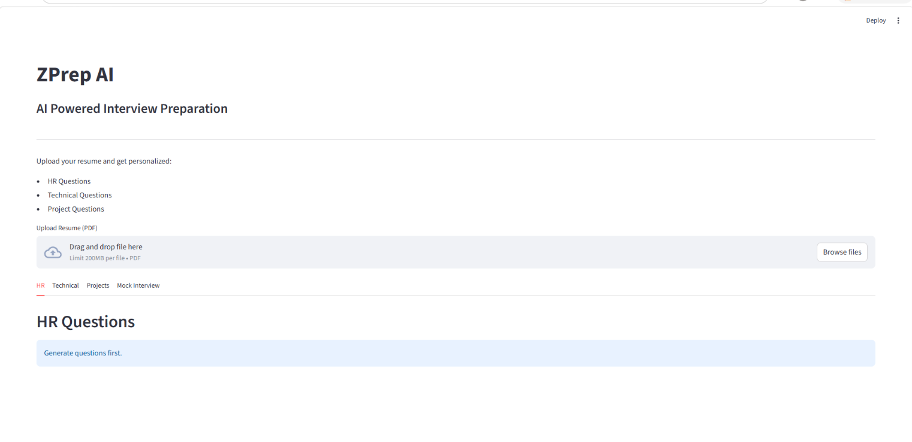
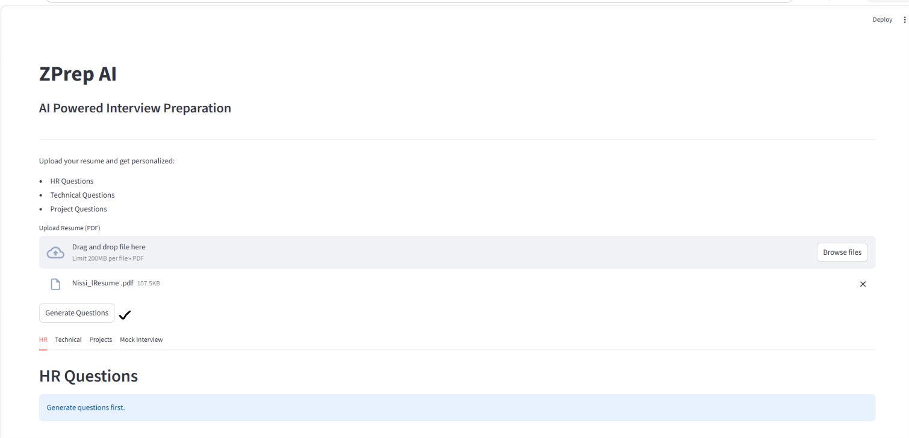
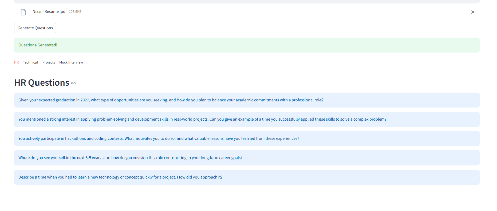
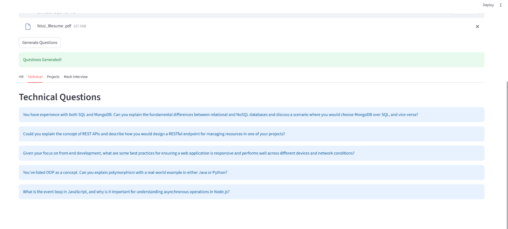
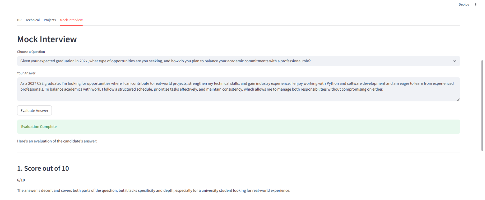
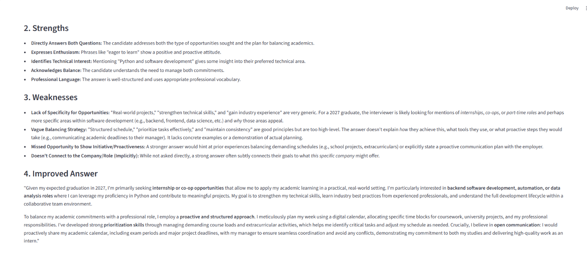

# 🚀 ZPrep AI Streamlit

AI-powered interview preparation platform that generates personalized interview questions from resumes and provides AI-based mock interview evaluation using Google Gemini API.

---

## 📌 Overview

ZPrep AI Streamlit helps students and job seekers prepare for interviews by analyzing their resumes and generating customized:

* HR Questions
* Technical Questions
* Project Questions

It also includes a mock interview mode where users can answer questions and receive AI-powered feedback, strengths, weaknesses, and improved answers.

---

## ✨ Features

### 📄 Resume Analysis

* Upload PDF resumes
* Extract resume text using PyPDF2
* Generate personalized interview questions

### 👨‍💼 HR Questions

Generate questions related to:

* Career goals
* Strengths and weaknesses
* Teamwork and leadership
* Communication skills

### 💻 Technical Questions

Generate questions based on:

* Programming languages
* Databases
* Frameworks
* Core subjects
* DSA concepts

### 📚 Project Questions

Generate questions about:

* Projects mentioned in the resume
* Design choices
* Challenges faced
* Technologies used

### 🎤 Mock Interview Mode

* Choose a generated question
* Enter your answer
* Receive AI-powered evaluation

### ⭐ AI Answer Evaluation

Provides:

* Feedback
* Strengths
* Weaknesses
* Improved answer suggestions

### 🔄 Dynamic Interface

* Tab-based navigation
* Session state management
* Dynamic question selection

---

## 🛠 Tech Stack

### Frontend

* Streamlit

### Backend

* Python

### AI

* Google Gemini API

### Resume Parsing

* PyPDF2

### Environment Variables

* python-dotenv

---

## 📂 Project Structure

```text
zprep-ai-streamlit/
│
├── app.py
├── question_generator.py
├── feedback_generator.py
├── resume_parser.py
├── requirements.txt
├── .gitignore
├── .env
├── temp_resume.pdf
│
├── images/
│   ├── home.png
│   ├── hr.png
│   ├── technical.png
│   ├── projects.png
│   ├── mock_interview.png
│   └── evaluation.png
│
└── __pycache__/
```

---

## ⚙️ Installation

### Clone the repository

```bash
git clone https://github.com/nissib8/zprep-ai-streamlit.git
cd zprep-ai-streamlit
```

### Create virtual environment

```bash
python -m venv venv
```

### Activate environment

#### Windows

```bash
venv\Scripts\activate
```

#### Linux / Mac

```bash
source venv/bin/activate
```

### Install dependencies

```bash
pip install -r requirements.txt
```

### Create `.env`

```env
GEMINI_API_KEY=your_api_key_here
```

---

## ▶️ Run Application

```bash
streamlit run app.py
```

Application runs at:

```text
http://localhost:8501
```

---

## 📷 Screenshots
   ..check the images folder

### Home Page




### HR Questions



### Technical Questions



### Project Questions


### Mock Interview


### AI Evaluation




---

## 🧠 Architecture

```text
Resume Upload
       │
       ▼
Resume Parser
(PyPDF2)
       │
       ▼
Gemini API
Question Generator
       │
       ▼
Structured Questions
(HR / Technical / Projects)
       │
       ▼
Mock Interview Mode
       │
       ▼
Answer Evaluation
       │
       ▼
AI Feedback
```

---

## 📋 Modules

### app.py

Main Streamlit interface.

### resume_parser.py

Extracts text from uploaded PDFs.

### question_generator.py

Generates structured interview questions using Gemini API.

### feedback_generator.py

Evaluates answers and provides AI-generated feedback.

---

## 🚀 Future Enhancements

* 📊 Dashboard
* ⭐ Score Extraction
* 📄 Download PDF Report
* 💾 SQLite History
* 🎙 Voice Interview
* 🌙 Themes
* 🎯 Difficulty Levels
* 🧠 DSA Mode
* 🏢 Company-Specific Questions
* 📈 Performance Tracking

---

## 👩‍💻 Author

**Nissi Mylabathula**

Final Year B.Tech CSE Student

---

## 🌟 Support

If you found this project useful, please consider giving it a ⭐ on GitHub!

---

### Built with ❤️ using Python, Streamlit and Google Gemini API.
